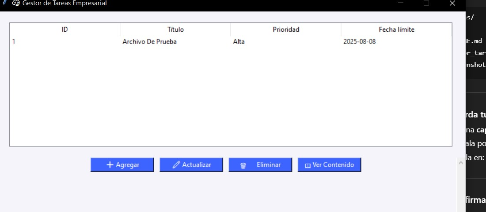
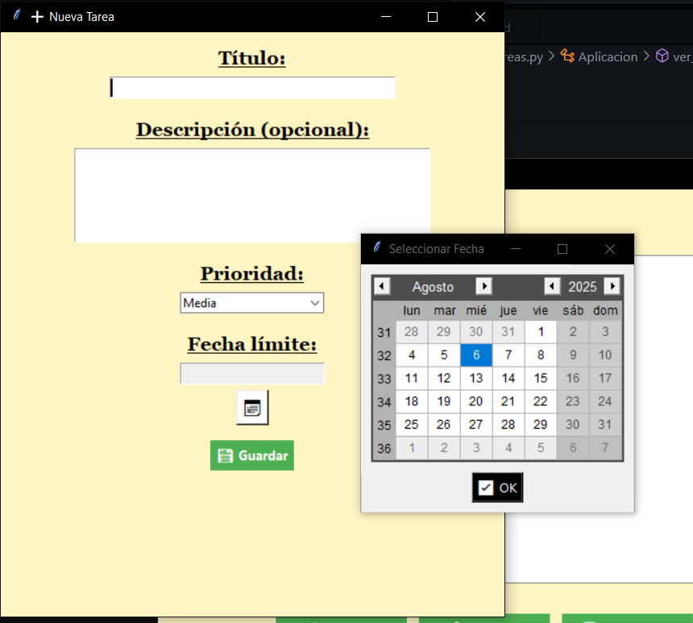
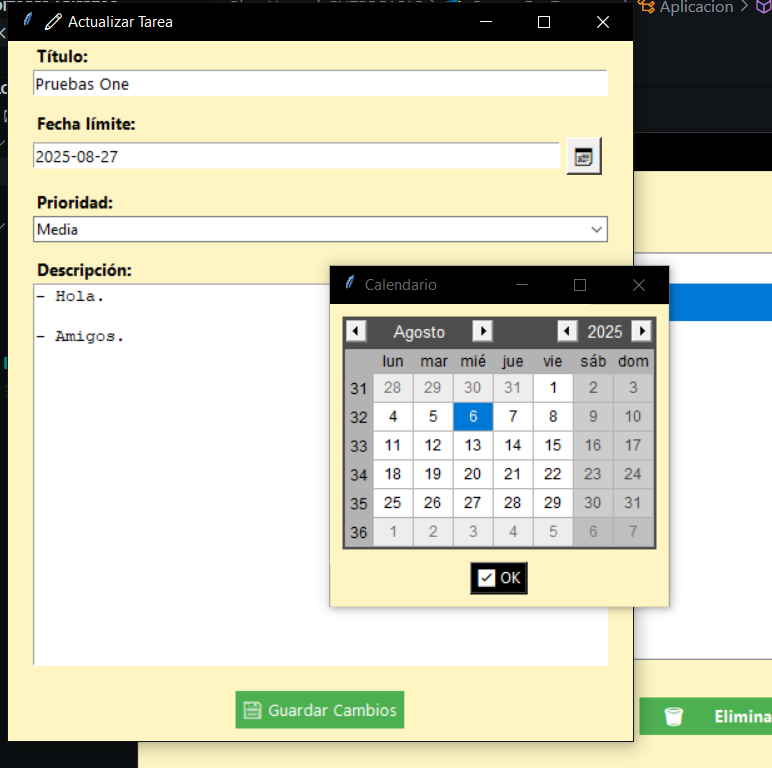
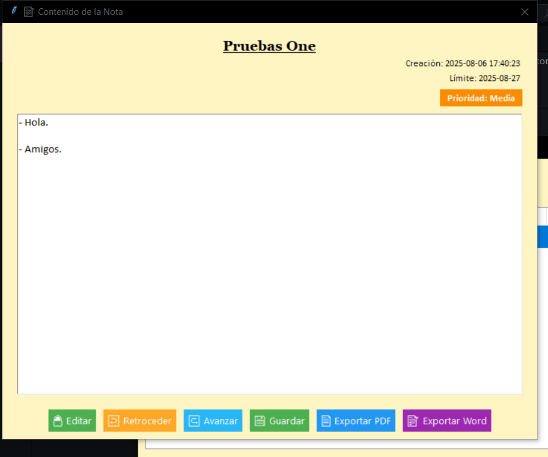

# 🧠 Gestor de Tareas Empresarial

Una aplicación de escritorio desarrollada en Python con Tkinter que permite gestionar tareas de forma visual, organizada y eficiente. Ideal para usuarios que desean un entorno gráfico intuitivo para planificar, actualizar y llevar el seguimiento de sus pendientes.

## 📦 Características principales

- ✅ **Agregar tareas** con título, descripción, prioridad y fecha límite.
- 🔄 **Actualizar tareas existentes** y mantener historial de modificaciones.
- 🗑️ **Eliminar tareas** del sistema con un solo clic.
- 🔍 **Visualización detallada** de cada tarea seleccionada.
- 📁 **Exportación opcional** de cada tarea como archivo `.txt`.
- 🧠 **Diseño limpio y profesional**, con Treeview, calendar y botones personalizados.
- 🗃️ **Base de datos local SQLite** incluida para persistencia de datos.

---

## 🧰 Tecnologías utilizadas

- **Python 3**
- **Tkinter** (Interfaz gráfica)
- **tkcalendar** (Selector de fechas)
- **SQLite3** (Base de datos local)
- **ttk** (Widgets estilizados)

---

## 📸 Capturas de pantalla

> 🧠 Interfaz principal de la aplicación:  
> 

> ➕ Ventana para agregar una nueva tarea: 
> 

> ✏️ Formulario para actualizar una tarea existente:
> 

> 📖 Vista detallada de una tarea seleccionada: 
> 

---

## 🚀 Cómo usar


```bash 
1. **Clona el repositorio:**
git clone https://github.com/1234567264/Bloc-Notas.git
cd Bloc-Notas

2. **Instala las dependencias:**
pip install tkcalendar

3. **Ejecuta la Aplicación:**
python gestor_tareas.py

(Reemplaza gestor_tareas.py con el nombre real del archivo si es diferente)

```